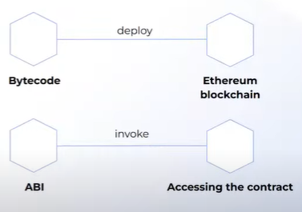

## Qué es una wallet ? 

* Hardware - Pape - Desktop - Mobile - Web 

## Encriptación asimétrica

Se crea un par de claves y sus elementos son:

* Clave pública.
* Clave privada: Número binario de 256 bit y se representa con 64 numeros y letras. 
* Dirección - Address

Hash

* Función criptográfica, transforma cualquier bloque arbitrario de datos en una serie de caracteres con una longitud fija. 
* La serie es única e irrepetible.

Ethereum

* Nodos
* Cuentas
* Transacciones
* Transacciones pendientes (mempool)

Ether

* Criptomoneda nativa de la red Ethereum
* El símbolo es ETH
* Se utiliza para las tarifas de las transacciones y la computación (ejecución de código de contrato inteligente)

Tokens 

* Representación de cualquier bien o servicio comercializable, o de una unidad de cuenta.
* Ejemplos:
-> Monedas virtuales
-> Token de Utilidad
* El estándar de tokens ER-C20 permite construir tokens
* El token Chainlink es un token ERC-677

Solidity

* Lenguaje de programación de alto nivel orientado a los contratos.
* El contrato es compilado por el compilador Solidity:
> * Bytecode (instrucciones EVM)
> * Definición de la ABI 
> * Interfas binaria ABI: Métodos públicos, entradas, valores de retorno, eventos.
* EVM es el lugar donde se ejecutan los contratos

Compilar código en Solidity

*  El contrato se publica subiendo el bytcode a la blockcchain
*  Para acceder al contrato, se necesita la definición ABI para saber con qué entradas y salidas son las que trabaja el contrato

Pago del Gas

* Es la unidad para llevar la cuenta de coste de ejecución.
* El coste del gas mide los recursos computacionales.

 

